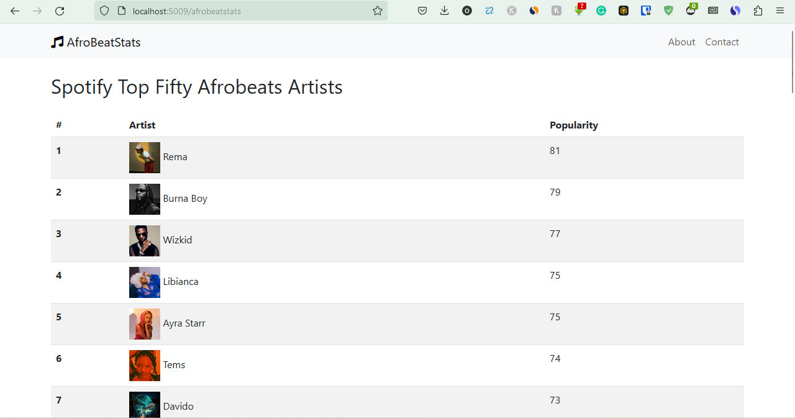

## About

AfroBeatStats is a simple webpage that tracks the top Nigerian artists based on the Spotify API.


### Built With

I built the project with Python and Flask. For the frontend, I made use of the bootstrap framework.

## Usage

To use the project, first run the `main.py`

```
main.py
```

This would populate the `file_storage.json` with the top afrobeats artists gotten from the Spotify API.


Run `app.py` to load flask, and then navigate to the route `http://localhost:5009/afrobeatstats`\
You should get the following:





Enjoy!